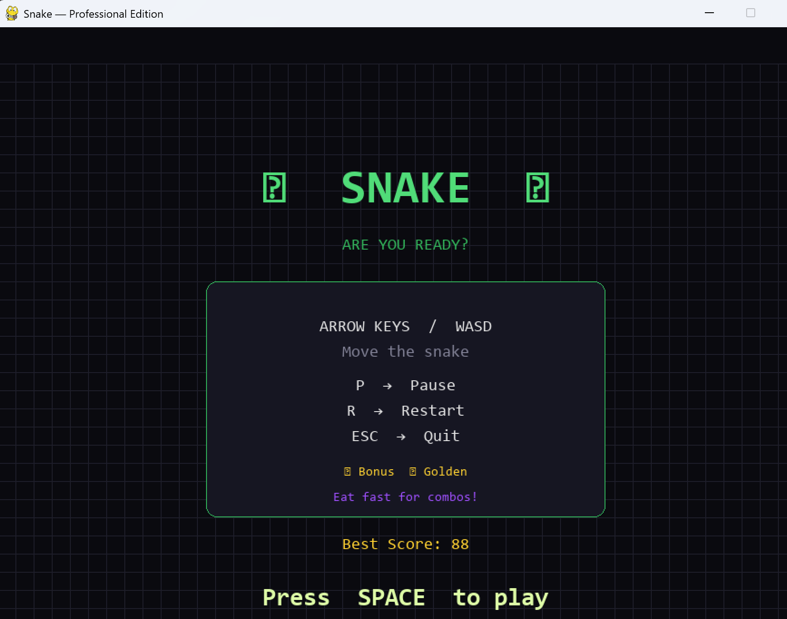

# Snake Game — Professional Edition

A feature-complete Snake game built with Python and Pygame, 
designed to demonstrate real software engineering principles 
through game development.

---

## Features

- Three food types — Normal (+1), Bonus (+3), Golden (+5)
- Combo multiplier — eat food quickly to multiply your points
- Particle burst effects on food collection and death
- Persistent leaderboard saved to JSON — top 10 scores survive restarts
- Game state machine — Menu, Playing, Paused, Game Over
- Snake eyes that follow movement direction
- Decoupled render loop — runs at 60fps regardless of game speed
- Level counter increases as your score climbs
- WASD and arrow key support

---

## Design Patterns Used

| Pattern | Where |
|---|---|
| Singleton | `GameManager` — one game instance only |
| Factory | `GameObjectFactory` — creates Snake and Food objects |
| Abstract class | `GameObject` — base class for all game objects |
| Enum | `Direction`, `GameState`, `FoodType` |
| Separation of concerns | `Renderer` class fully decoupled from game logic |

---

## Controls

| Key | Action |
|---|---|
| Arrow keys / WASD | Move the snake |
| SPACE | Start game from menu |
| P | Pause / Resume |
| R | Restart |
| ESC | Back to menu / Quit |

---

## How to Run

**Requirements:**
- Python 3.10+
- Pygame

**Install Pygame:**
```bash
pip install pygame
```

**Run the game:**
```bash
python snake.py
```

---

## Project Structure
```
snake-game-python/
│
├── snake.py           # Main game file
├── highscores.json    # Auto-generated on first run
└── README.md
```

---

## Screenshots



---

## What I Learned

- Implementing classic OOP design patterns in a real project
- Building a game loop decoupled from render rate
- Managing game state with enums instead of boolean flags
- Particle physics — velocity, gravity, decay, lifecycle
- Persistent data storage with JSON

---

## Built By

Azmir Khan — AI Systems student at Vilnius Gediminas Technical University, Lithuania  
GitHub: [azmirk123](https://github.com/azmirk123)  
Email: azmirk671@gmail.com
